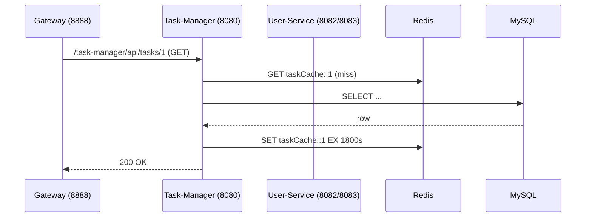

# 🧩 Task Management System — 微服务任务管理系统

> 一个基于 **Spring Boot 3.3** + **Spring Cloud 2023** 的微服务示例，整合 MySQL 8、Redis 7、Docker Compose、日志追踪、熔断降级与聚合 Swagger 文档，可用于中高级 Java 后端面试展示或自学实践。


______________________________________________________________________

## 📁 项目结构

```text
 task-management-system/
 ├── registry-server/     # 📘 Eureka 注册中心 (8761)
 ├── gateway-server/      # 🔀 Spring Cloud Gateway + Swagger 聚合 (8888)
 ├── user-service/        # 👤 用户服务 (8082 / 8083)
 ├── task-manager/        # ✅ 任务&分类服务 (8080)
 ├── common-lib/          # 📦 公共 DTO / 日志切面 / 响应封装
 └── docker/docker-compose.yml   # 🐳 MySQL + Redis
```

> **多模块 monorepo**：公共代码抽取到 `common-lib`，其余服务仅关注各自业务。

______________________________________________________________________

## 🧱 技术栈

| 领域 | 组件 |
| ------- | ----------------------------------------------- |
| 微服务注册发现 | **Netflix Eureka** |
| 网关 | **Spring Cloud Gateway** |
| 客户端负载均衡 | **Spring Cloud LoadBalancer** |
| 声明式调用 | **OpenFeign** + **Resilience4j CircuitBreaker** |
| 安全 | **Spring Security** Basic Auth + 全局 Feign 认证拦截器 |
| 数据持久化 | **Spring Data JPA** / MySQL 复合索引优化 |
| 缓存 | **Redis** 读穿透/击穿/雪崩方案 + `@Cacheable` |
| 文档 | **SpringDoc OpenAPI** 聚合到 Gateway |
| 观测 | Logback + MDC traceId 统一日志；Actuator (可选) |

______________________________________________________________________

## 🔗 服务调用链（示例）



- 同一路径亦可通过 `Feign → LoadBalancer → USER-SERVICE` 演示服务间调用与熔断降级。

______________________________________________________________________

## 🚀 快速启动

```bash
# 1️⃣ 构建全部模块
mvn clean install -DskipTests

# 2️⃣ 启动基础设施
cd docker && docker compose up -d        # MySQL(3306) + Redis(6379)

# 3️⃣ 依次启动服务（新终端中执行）
mvn -pl registry-server spring-boot:run              # 8761
mvn -pl user-service spring-boot:run -Dserver.port=8082
mvn -pl user-service spring-boot:run -Dserver.port=8083 &
mvn -pl task-manager spring-boot:run                 # 8080
mvn -pl gateway-server spring-boot:run               # 8888
```

| URL | 说明 |
| ------------------------------------------------------------------------------ | ------------- |
| [http://localhost:8761](http://localhost:8761) | Eureka 控制台 |
| [http://localhost:8888/swagger-ui.html](http://localhost:8888/swagger-ui.html) | 聚合 Swagger UI |

默认 Basic Auth 账号：`renda / password`

______________________________________________________________________

## 🛡️ 统一认证机制

`task-manager` 在调用 `user-service` 时无需关心凭证，`GlobalFeignAuthInterceptor` 会读取 `application-common.yml` 中的配置自动注入 `Authorization` 头，支持 **Basic / Bearer / 自定义 Header** 三种方式。

______________________________________________________________________

## 🧩 响应规范

```json
{
  "status": 200,
  "message": "Success",
  "data": { ... }
}
```

失败或熔断降级时以相同结构返回，方便前端统一处理。

______________________________________________________________________

## 🧪 测试要点

- **负载均衡**：多次请求 `/task-manager/api/calls/hello-user-feign`，观察轮询 8082/8083。
- **缓存命中**：`GET /task-manager/api/tasks/1` 二次访问用时从 ~120 ms → ~8 ms。
- **熔断**：停掉 `user-service` 实例，CircuitBreaker 打开并返回 fallback JSON。

______________________________________________________________________

## 🔮 待办 & 进阶

- Spring Cloud Config Server + 动态刷新
- JWT + OAuth2 统一网关鉴权
- GitHub Actions CI/CD & Docker 发布
- Prometheus + Grafana 指标监控
- Kubernetes Helm Chart 部署

______________________________________________________________________

## © 2025 Renda Zhang — Apache 2.0 License
